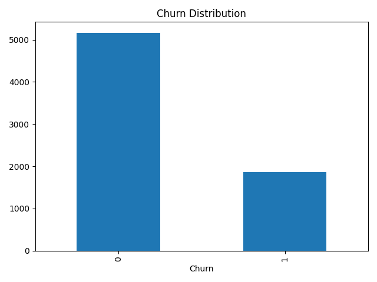

# Customer Churn Prediction using Machine Learning

## Project Overview

Customer churn is one of the most important business challenges faced by telecom, subscription, banking, and e-commerce companies.

This project predicts whether a customer is likely to leave a telecom service provider using machine learning techniques and customer behavioral data.

The project combines:

- Exploratory Data Analysis (EDA)
- Business Insight Generation
- Feature Engineering
- Logistic Regression
- Random Forest Classification
- Model Evaluation

---

## Business Problem

Customer acquisition is significantly more expensive than customer retention.

The goal of this project is to identify customers who are likely to churn so that businesses can proactively take retention actions.

Questions addressed:

- Which customers are most likely to leave?
- What factors contribute to churn?
- Which factors improve customer retention?
- Which machine learning model performs best for churn prediction?

---

## Dataset

### IBM Telco Customer Churn Dataset

Dataset Source:

https://www.kaggle.com/datasets/blastchar/telco-customer-churn

Dataset Statistics:

- 7,043 Customers
- 21 Original Features
- Customer Demographics
- Subscription Information
- Billing Information
- Churn Status

Target Variable:

| Variable | Description |
|-----------|-------------|
| Churn | Whether the customer left the service |

---

## Technologies Used

- Python
- Pandas
- NumPy
- Matplotlib
- Seaborn
- Scikit-Learn
- Jupyter Notebook

---

## Project Workflow

Customer Data
↓
Data Cleaning
↓
Exploratory Data Analysis
↓
Feature Engineering
↓
One-Hot Encoding
↓
Train-Test Split
↓
Model Training
↓
Performance Evaluation
↓
Business Recommendations

---

## Exploratory Data Analysis

### Churn Distribution

- Customers Retained: 73.46%
- Customers Churned: 26.54%

### Key Business Findings

#### Contract Type

| Contract Type | Churn Rate |
|--------------|------------|
| Month-to-Month | 42.7% |
| One Year | 11.3% |
| Two Year | 2.8% |

**Insight:** Long-term contracts significantly reduce churn.

---

#### Internet Service

| Service | Churn Rate |
|----------|------------|
| Fiber Optic | 41.9% |
| DSL | 19.0% |
| No Internet | 7.4% |

**Insight:** Fiber customers show the highest churn risk.

---

#### Payment Method

| Payment Method | Churn Rate |
|---------------|------------|
| Electronic Check | 45.3% |
| Bank Transfer | 16.7% |
| Credit Card | 15.3% |
| Mailed Check | 19.2% |

**Insight:** Electronic check users are significantly more likely to churn.

---

#### Customer Tenure

| Customer Group | Average Tenure |
|---------------|----------------|
| Retained Customers | 37.7 Months |
| Churned Customers | 18.0 Months |

**Insight:** Customers are most vulnerable to churn during the early stages of their lifecycle.

---

## Data Preparation

Performed:

- Removed Customer ID
- Converted TotalCharges to Numeric
- Handled Missing Values
- One-Hot Encoded Categorical Features
- Train-Test Split (80/20)

Final Dataset:

- 7,032 Customers
- 30 Features

---

# Machine Learning Models

## 1. Logistic Regression

### Performance

| Metric | Score |
|----------|----------|
| Accuracy | 80.31% |
| Precision | 65% |
| Recall | 57% |
| F1 Score | 61% |
| ROC-AUC | 0.836 |

### Top Churn Drivers

- Fiber Optic Internet
- Electronic Check Payment
- Paperless Billing
- Multiple Lines
- Senior Citizens

### Top Retention Drivers

- Two-Year Contracts
- One-Year Contracts
- Online Security
- Tech Support
- Dependents

---

## 2. Random Forest

### Performance

| Metric | Score |
|----------|----------|
| Accuracy | 78.68% |
| Precision | 62% |
| Recall | 51% |
| F1 Score | 56% |
| ROC-AUC | 0.818 |

### Most Important Features

- Total Charges
- Tenure
- Monthly Charges
- Fiber Optic Internet
- Electronic Check

---

## Model Comparison

| Metric | Logistic Regression | Random Forest |
|----------|----------|----------|
| Accuracy | 80.31% | 78.68% |
| ROC-AUC | 0.836 | 0.818 |
| Recall | 57% | 51% |
| Precision | 65% | 62% |

### Final Model Selected

✅ Logistic Regression

Reason:

- Higher Accuracy
- Higher ROC-AUC
- Better Recall
- Better Interpretability

---

## Business Recommendations

### Reduce Churn

- Encourage customers to move from month-to-month plans to annual contracts.
- Improve customer experience for fiber optic users.
- Promote automatic payment methods over electronic checks.
- Focus retention campaigns on new customers during their first 18 months.

### Improve Retention

- Bundle Online Security services.
- Bundle Tech Support services.
- Offer loyalty rewards for long-term customers.
- Provide incentives for contract upgrades.

---

## Visualizations

### Churn Distribution

### Contract Type vs Churn

### Top Churn Drivers

### Top Retention Drivers

---

## Key Learnings

Through this project I learned:

- Exploratory Data Analysis
- Business Analytics
- Feature Engineering
- Logistic Regression
- Random Forest Classification
- Model Evaluation
- ROC-AUC Analysis
- Customer Retention Analytics
- Churn Prediction Workflows

---

## Real-World Applications

The same approach can be applied to:

- Telecom Customer Retention
- Subscription Businesses
- Banking Customer Attrition
- E-Commerce Customer Retention
- Loyalty Program Analytics
- SaaS Churn Prediction

---

## Future Improvements

- XGBoost
- LightGBM
- Hyperparameter Tuning
- SHAP Explainability
- Customer Lifetime Value Prediction
- Real-Time Churn Monitoring

---

## Author

Aditya Hande